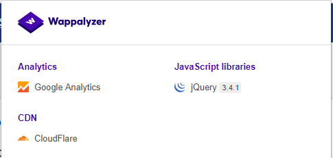

# Визначення веб-фреймворку

| ID |
|---|
| WSTG-INFO-08 |

## Вступ
Немає нічого нового під сонцем, і майже кожен веб-додаток, який можна було б розглянути для розробки, вже був створений. З численними безкоштовними та відкритими програмними проектами, які активно розвиваються та впроваджуються по всьому світу, дуже ймовірно, що тестування безпеки програми зустріне ціль, яка повністю або частково залежить від цих добре відомих додатків або фреймворків (наприклад, WordPress, phpBB, MediaWiki тощо). Знання компонентів веб-додатку, які тестуються, значно допомагає в процесі тестування та суттєво зменшує зусилля, які потрібні під час тестування. Ці популярні веб-додатки мають відомі HTML-заголовки, файли cookie та структури каталогів, які можна перерахувати для визначення застосунку. Більшість веб-фреймворків мають кілька маркерів у цих місцях, які допомагають зловмиснику або тестеру їх розпізнавати. Це, по суті, те, що роблять усі автоматизовані інструменти: вони шукають маркер у заздалегідь визначеному місці, а потім порівнюють його з базою відомих підписів. Для кращої точності зазвичай використовують кілька маркерів.

## Цілі тестування
- Визначити компоненти, що використовуються веб-додатками.

## Як тестувати
### Тестування чорної скриньки
Існує кілька загальних місць, які слід розглянути для визначення фреймворків або компонентів:

- HTTP-заголовки
- Файли Cookie
- HTML вихідний код
- Конкретні файли та папки
- Розширення файлів
- Повідомлення про помилки

### HTTP-заголовки
Найбільш базовою формою ідентифікації веб-фреймворку є перевірка поля `X-Powered-By` в заголовку відповіді HTTP. Існує безліч інструментів, які можна використовувати для визначення цілі, найбільш простим з яких є netcat.

Розглянемо наступний запит-відповідь HTTP: 
```
$ nc 127.0.0.1 80
HEAD / HTTP/1.0

HTTP/1.1 200 OK
Server: nginx/1.0.14
[...]
X-Powered-By: Mono
```

З поля `X-Powered-By` ми можемо зрозуміти, що веб-додаток, ймовірно, використовує фреймворк `Mono`. Однак, хоча цей підхід є простим і швидким, ця методологія не працює в 100% випадків. Можна легко вимкнути заголовок `X-Powered-By` за допомогою належної конфігурації. Існує також кілька технік, які дозволяють веб-сайту затемнювати HTTP-заголовки (приклад можна знайти в розділі [Виправлення](https://owasp.org/www-project-web-security-testing-guide/stable/4-Web_Application_Security_Testing/01-Information_Gathering/08-Fingerprint_Web_Application_Framework#Remediation)). У наведеному вище прикладі також можна відзначити, що використовується певна версія `nginx` для обслуговування контенту.
Таким чином, у тому ж прикладі тестер міг або пропустити заголовок `X-Powered-By`, або отримати відповідь, схожу на наступну:
```
HTTP/1.1 200 OK
Server: nginx/1.0.14
Date: Sat, 07 Sep 2013 08:19:15 GMT
Content-Type: text/html;charset=ISO-8859-1
Connection: close
Vary: Accept-Encoding
X-Powered-By: Blood, sweat and tears
```
Іноді існують додаткові HTTP-заголовки, які вказують на певний фреймворк. У наведеному прикладі, згідно з інформацією з HTTP-запиту, можна побачити, що заголовок `X-Powered-By` містить версію PHP. Однак заголовок `X-Generator` вказує на те, що використовується фреймворк `Swiftlet`, що допомагає тестеру з проникнення розширити свої вектори атаки. При виконанні визначення (fingerprinting) ретельно перевіряйте кожен HTTP-заголовок на предмет таких витоків інформації.
```
HTTP/1.1 200 OK
Server: nginx/1.4.1
Date: Sat, 07 Sep 2013 09:22:52 GMT
Content-Type: text/html
Connection: keep-alive
Vary: Accept-Encoding
X-Powered-By: PHP/5.4.16-1~dotdeb.1
Expires: Thu, 19 Nov 1981 08:52:00 GMT
Cache-Control: no-store, no-cache, must-revalidate, post-check=0, pre-check=0
Pragma: no-cache
X-Generator: Swiftlet
```
### Файли cookie
Ще один подібний і дещо надійніший спосіб визначити поточний веб-фреймворк — це куки, специфічні для фреймворку.
Розглянемо наступний HTTP-запит:


*Рисунок 4.1.8-7: CakePHP HTTP Запит*

Cookie `CAKEPHP` була автоматично встановлена, що дає інформацію про використовуваний фреймворк. Список загальних назв куків наведено в розділі Cookies. Проте існують обмеження в довірі до цього механізму ідентифікації — можливо змінити назву куків. Наприклад, для обраного фреймворку `CakePHP` це можна зробити за допомогою наступної конфігурації (витяг з `core.php`):
```
/**
* The name of CakePHP's session cookie.
*
* Note the guidelines for Session names states: "The session name references
* the session id in cookies and URLs. It should contain only alphanumeric
* characters."
* @link http://php.net/session_name
*/
Configure::write('Session.cookie', 'CAKEPHP');
```
Однак ці зміни менш ймовірно будуть внесені, ніж зміни до заголовка `X-Powered-By`, тому цей підхід до ідентифікації можна вважати більш надійним.

### HTML вихідний код
Ця техніка базується на пошуку певних шаблонів у вихідному коді HTML-сторінки. Часто можна знайти багато інформації, яка допомагає тестеру розпізнати конкретний компонент. Одним із загальних маркерів є HTML-коментарі, які безпосередньо вказують на розкриття фреймворку. Часом можна знайти певні шляхи, специфічні для фреймворку, тобто посилання на папки CSS або JS, характерні для фреймворку. Нарешті, специфічні змінні скриптів також можуть вказувати на певний фреймворк.

З наведеного нижче скріншота можна легко дізнатися про використовуваний фреймворк та його версію завдяки згаданим маркерам. Коментарі, специфічні шляхи та змінні скриптів можуть допомогти зловмиснику швидко визначити екземпляр фреймворку ZK.


*Рисунок 4.1.8-2: Приклад HTML-джерела фреймворка ZK*

Часто така інформація розміщується в секції `<head>` HTTP-відповіді, у тегах `<meta>` або в кінці сторінки. Однак варто аналізувати всю відповідь, оскільки це може бути корисно для інших цілей, таких як перевірка корисних коментарів та прихованих полів. Іноді веб-розробники не дуже переймаються приховуванням інформації про використовувані фреймворки або компоненти. Можливо натрапити на щось подібне внизу сторінки:


*Рисунок 4.1.8-3: Нижня частина сторінки Banshee*

### Специфічні файли та папки
Існує ще один підхід, який значно допомагає зловмиснику або тестеру з високою точністю ідентифікувати додатки або компоненти. Кожен веб-компонент має свою специфічну структуру файлів і папок на сервері. Було відзначено, що можна побачити специфічний шлях з вихідного коду HTML-сторінки, але іноді вони не представлені явно і все ще знаходяться на сервері.

Для їх виявлення використовується техніка, відома як примусове переглядання (forced browsing) або "dirbusting". Dirbusting — це брутфорс цілі з відомими папками та іменами файлів з подальшим моніторингом HTTP-відповідей для перерахунку вмісту сервера. Цю інформацію можна використовувати як для пошуку стандартних файлів і атак на них, так і для визначення (fingerprinting) веб-додатку. Dirbusting можна виконувати кількома способами, нижче наведено приклад успішної атаки dirbusting на ціль, що працює на базі WordPress, з використанням визначеного списку та функціоналу intruder Burp Suite.


*Рисунок 4.1.8-4: Dirbusting за допомогою Burp*

Ми можемо бачити, що для деяких специфічних папок WordPress (наприклад, `/wp-includes/`, `/wp-admin/` та `/wp-content/`) HTTP-відповіді становлять 403 (Заборонено), 302 (Знайдено, перенаправлення на `wp-login.php`) та 200 (ОК) відповідно. Це хороший показник того, що ціль працює на базі WordPress. Таким же чином можна проводити dirbusting для різних папок плагінів додатку та їх версій. На наведеному нижче скріншоті можна побачити типовий файл CHANGELOG плагіна Drupal, який надає інформацію про використовуваний додаток і розкриває вразливу версію плагіна.


*Рисунок 4.1.8-5: Вразливість Botcha у Drupal*

Порада:
Перед початком dirbusting спершу перевірте файл `robots.txt`. Іноді специфічні для додатка папки та інша чутлива інформація можуть бути знайдені і там. Приклад такого файлу `robots.txt` наведено на скріншоті нижче.


*Рисунок 4.1.8-6: Розкриття інформації про robots*

Специфічні файли та папки відрізняються для кожного конкретного додатку. Якщо ідентифікований додаток або компонент є відкритим програмним забезпеченням, може бути доцільно налаштувати тимчасову інсталяцію під час тестів на проникнення, щоб краще зрозуміти, яка інфраструктура або функціональність представлена, і які файли можуть залишатися на сервері. Однак існує кілька хороших списків файлів; одним із хороших прикладів є [списки слів FuzzDB, що містять передбачувані файли та папки](https://github.com/fuzzdb-project/fuzzdb).

### Розширення файлів
URL-адреси можуть містити розширення файлів, що також може допомогти в ідентифікації веб-платформи або технології.
Наприклад, в OWASP wiki використовується PHP:
```
https://wiki.owasp.org/index.php?title=Fingerprint_Web_Application_Framework&action=edit&section=4
```
Ось кілька загальних розширень веб-файлів та пов’язаних технологій:

- `php` – PHP
- `.aspx` – Microsoft ASP.NET
- `.jsp` – Java Server Pages

### Повідомлення про помилки
Як видно з наведеного нижче скріншота, зазначений шлях до файлової системи вказує на використання WordPress (`wp-content`). Тестери також повинні бути обізнані, що WordPress є PHP-базованим (`functions.php`).


*Рисунок 4.1.8-7: Помилка парсингу WordPress*

# Загальні ідентифікатори  
### Файли cookie

| Фреймворк          | Назва Cookie                      |
|--------------------|----------------------------------|
| Zope               | zope3                            |
| CakePHP            | cakephp                          |
| Kohana             | kohanasession                    |
| Laravel            | laravel_session                   |
| phpBB              | phpbb3_                          |
| WordPress          | wp-settings                      |
| 1C-Bitrix         | BITRIX_                          |
| AMPcms             | AMP                              |
| Django CMS         | django                           |
| DotNetNuke        | DotNetNukeAnonymous              |
| e107               | e107_tz                          |
| EPiServer          | EPiTrace, EPiServer              |
| Graffiti CMS       | graffitibot                      |
| Hotaru CMS         | hotaru_mobile                    |
| ImpressCMS         | ICMSession                       |
| Indico             | MAKACSESSION                     |
| InstantCMS         | InstantCMS[logdate]             |
| Kentico CMS        | CMSPreferredCulture              |
| MODx               | SN4[12symb]                     |
| TYPO3              | fe_typo_user                    |
| Dynamicweb         | Dynamicweb                       |
| LEPTON             | lep[some_numeric_value]+sessionid |
| Wix                | Domain=.wix.com                 |
| VIVVO              | VivvoSessionId                   |

### HTML вихідний код

| Застосування   | Ключове слово                                                              |
|---------------|---------------------------------------------------------------------|
| WordPress     | `<meta name="generator" content="WordPress 3.9.2" />`              |
| phpBB         | `<body id="phpbb"`                                                  |
| Mediawiki     | `<meta name="generator" content="MediaWiki 1.21.9" />`             |
| Joomla        | `<meta name="generator" content="Joomla! - Open Source Content Management" />` |
| Drupal        | `<meta name="Generator" content="Drupal 7 (http://drupal.org)" />` |
| DotNetNuke    | `DNN Platform - [http://www.dnnsoftware.com](http://www.dnnsoftware.com)` |


### Загальні маркери
- `%framework_name%`
- `powered by`
- `built upon`
- `running`

### Специфічні маркери
| Фреймворк               | Ключове слово                       |
|------------------------|------------------------------------|
| Adobe ColdFusion       | `<!-- START headerTags.cfm`       |
| Microsoft ASP.NET      | `__VIEWSTATE`                      |
| ZK                     | `<!-- ZK`                          |
| Business Catalyst      | `<!-- BC_OBNW -->`                 |
| Indexhibit             | `ndxz-studio`                     |

### Виправлення
Хоча можна докладати зусилля для використання різних назв куків (зміною конфігурацій), приховування або зміни шляхів до файлів/каталогів (через переписування або зміни в коді), видалення відомих заголовків тощо, ці зусилля зводяться до "безпеки через затемнення". Власники/адміністратори систем повинні усвідомлювати, що ці зусилля лише уповільнюють дії найосновніших супротивників. Час та зусилля можуть бути краще витрачені на підвищення обізнаності зацікавлених сторін та обслуговування рішень.

### Інструменти
Нижче наведено список загальних і відомих інструментів. Також існує багато інших утиліт, а також інструментів для визначення фреймворків.

### WhatWeb
Вебсайт: https://github.com/urbanadventurer/WhatWeb
В даний час це один із найкращих інструментів для визначення фреймворків на ринку. Включений у стандартну збірку Kali Linux. Мова: Ruby. Збіги для визначення фреймворків здійснюються за допомогою:

- Текстових рядків (чутливі до регістру)
- Регулярних виразів
- Запитів до Google Hack Database (обмежений набір ключових слів)
- MD5-хешів
- Розпізнавання URL
- Шаблонів HTML-тегів
- Користувацького коду на Ruby для пасивних і агресивних операцій
Приклад виходу наведено на скріншоті нижче:


*Рисунок 4.1.8-8: Приклад виходу WhatWeb*

### Wappalyzer
Вебсайт: https://www.wappalyzer.com/
Wappalyzer доступний у кількох моделях використання, найбільш популярною з яких, ймовірно, є розширення для Firefox/Chrome. Вони працюють тільки на основі збігів регулярних виразів і не потребують нічого, крім завантаження сторінки в браузері. Інструмент працює повністю на рівні браузера та надає результати у формі значків. Хоча іноді можуть бути хибнопозитивні результати, це дуже зручно для швидкого розуміння, які технології були використані для створення цільового веб-сайту одразу після перегляду сторінки.

Приклад виходу плагіна наведено на скріншоті нижче.



*Рисунок 4.1.8-9: Вихідні дані Wappalyzer для вебсайту OWASP*

## Посилання
### Офіційні документи

[Сауміл Шах: "Введення в HTTP-ідентифікацію"](https://web.archive.org/web/20190526182734/https://net-square.com/httprint_paper.html)
[Анат Шривістава: "Ідентифікація веб-додатків"](https://anantshri.info/articles/web_app_finger_printing.html)
