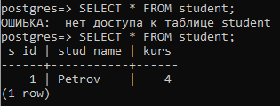
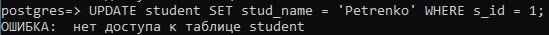

# 2.2 Вибіркове керування санкціонованим доступом в СКБД PostgreSQL

### Завдання 2.2.1 - 2.2.7

### Завдання 2.2.8
Від імені нового користувача виконайте запит на отримання даних з таблиці (select * from таблиця). 

### Завдання 2.2.9
Встановіть повноваження на читання таблиці новому користувачеві.

### Завдання 2.2.10
Повторіть крок 8.

### Завдання 2.2.11
Зніміть повноваження на читання таблиці для нового користувача.

### Завдання 2.2.12
Повторіть крок 8.

### Завдання 2.2.13
Створіть команду оновлення даних таблиці (UPDATE) і виконайте її від імені
нового користувача.

### Завдання 2.2.14
Встановіть повноваження на оновлення таблиці новому користувачу.

### Завдання 2.2.15
Повторіть крок 13.

### Завдання 2.2.16
Створіть команду видалення запису таблиці (DELETE) і виконайте її від імені нового користувача. Проаналізуйте результат виконання команди.

### Завдання 2.2.17
Встановіть повноваження на видалення таблиці новому користувачеві.

### Завдання 2.2.18
Повторіть крок 16.

### Завдання 2.2.19
Зніміть всі повноваження з таблиці для нового користувача.

### Завдання 2.2.20
Створіть команду внесення запису в таблицю (INSERT) і виконайте її від імені нового користувача. Проаналізуйте результат виконання команди.

### Завдання 2.2.21
Встановіть повноваження на внесення даних до таблиці для ролі.

### Завдання 2.2.22
Повторіть крок 20.

