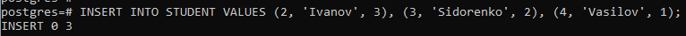
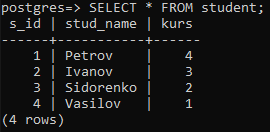
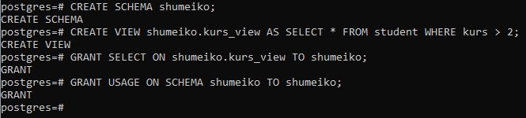
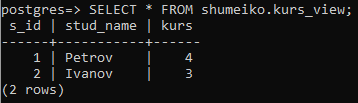
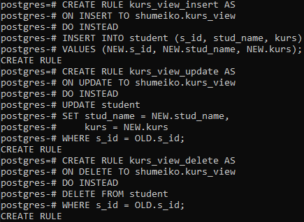
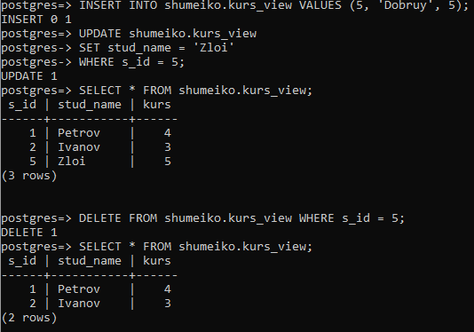

# 2.3 Вибіркове керування санкціонованим доступом до даних з горизонтальним обмеженням доступу

### Завдання 2.3.1
Заповніть таблицю БД ще трьома рядками.

 

### Завдання 2.3.2
Створіть схему даних користувача, назва якої співпадає з назвою користувача, та
створіть віртуальну таблицю у цій схемі з правилами вибіркового керування доступом для
користувача так, щоб він міг побачити тільки деякі з рядків таблиці з урахуванням одного
значення її останнього стовпчика.

 

### Завдання 2.3.3-4
Встановіть з’єднання з СКБД від імені нового користувача. Перевірте роботу механізму вибіркового керування, виконавши операцію SELECT
до віртуальної таблиці.

 

### Завдання 2.3.5
Створіть INSERT/UPDATE/DELETE-правила обробки операцій редагування віртуальної таблиці.

 

### Завдання 2.3.6
Перевірте роботу механізму вибіркового керування, виконавши операції INSERT, UPDATE, DELETE до віртуальної таблиці.

 
