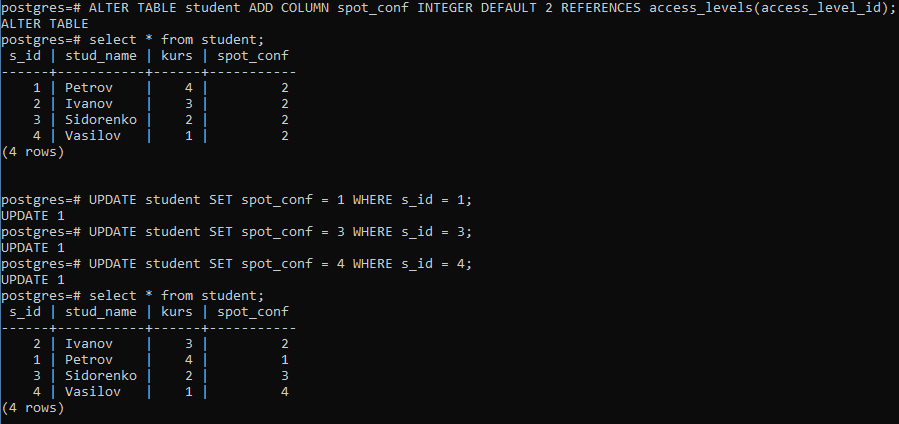

# 2.4 Повноважне керування санкціонованим доступом до даних

### Завдання 2.4.1
Створіть у БД структури даних, необхідні для роботи повноважного керування доступом.

 

### Завдання 2.4.2
Додайте до таблиці з даними стовпчик, який буде зберігати мітки конфіденційності.
Визначте для кожного рядка таблиці мітки конфіденційності, які будуть різнитися (для
кожного рядка своя мітка).

 

### Завдання 2.4.3
Визначте для користувача його рівень доступу.

 

### Завдання 2.4.4
Створіть нову схему даних, назва якої співпадає з назвою користувача.

 

### Завдання 2.4.5
Створіть віртуальну таблицю, назва якої співпадає з назвою реальної таблиці та яка
забезпечує SELECT-правила повноважного керування доступом для користувача.

 
 

### Завдання 2.4.6
Створіть INSERT/UPDATE/DELETE-правила повноважного керування доступом для користувача.

 

### Завдання 2.4.7-8
Встановіть з’єднання з СКБД від імені нового користувача. Від імені нового користувача перевірте роботу механізму повноважного керування, виконавши операції SELECT, INSERT, UPDATE, DELETE

 
